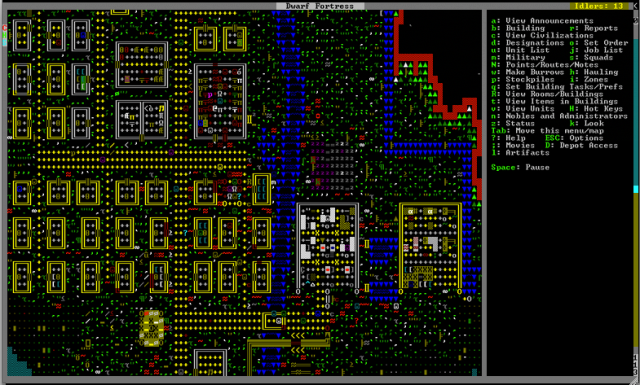
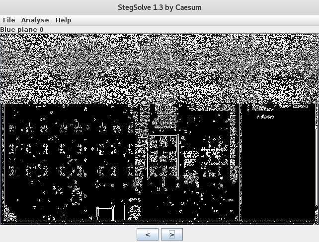
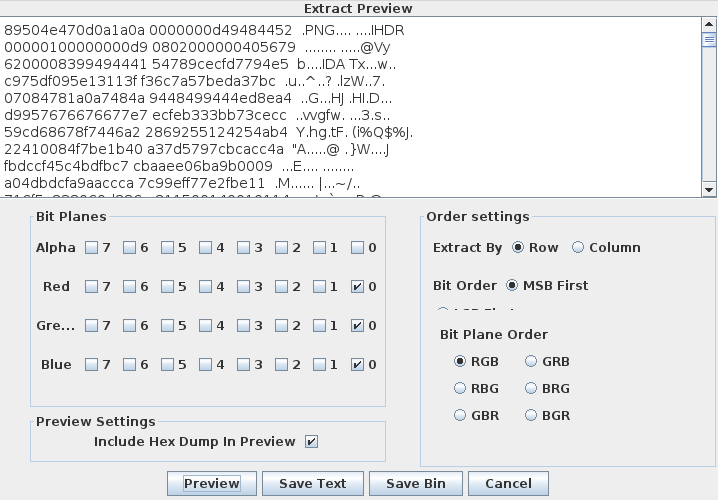
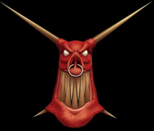
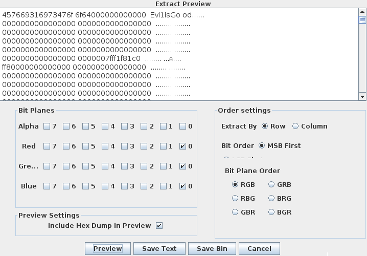

_[<<< Return to GreHack CTF 2016 tasks and writeups](/2016-grehack-ctf)_
# Monster Den (Stego, 100 points)

>soon

>sha1sum : 57af654d7e46947938f13a9344d0f1ac933ac173

This was the third out of five steganography challenges:
we had to find a flag in [this picture](monster_den.png).



Let's see who really is this "Monster Den" with [pngcheck](http://www.libpng.org/pub/png/apps/pngcheck.html),
it might be totally something else than expected.

```console
root@blinils:~/GH16# file monster_den.png
monster_den.png: PNG image data, 640 x 385, 8-bit/color RGBA, non-interlaced
```

```console
root@blinils:~/GH16# pngcheck -s -t -v monster_den.png
Scanning: monster_den.png
File: monster_den-1
  chunk IHDR at offset 0x0000c, length 13
    640 x 385 image, 32-bit RGB+alpha, non-interlaced
  chunk IDAT at offset 0x00025, length 65536
    zlib: deflated, 32K window, default compression
  chunk IDAT at offset 0x10031, length 65536
  chunk IDAT at offset 0x2003d, length 65536
  chunk IDAT at offset 0x30049, length 65536
  chunk IDAT at offset 0x40055, length 65457
  chunk IEND at offset 0x50012, length 0
No errors detected in monster_den-1 (7 chunks, -1913988.0% compression).
```

This seems to be a real PNG image. But is there hidden data in it?

Let's check this with four tools: [binwalk](https://github.com/devttys0/binwalk/wiki/Quick-Start-Guide),
[hachoir-subfile](https://bitbucket.org/haypo/hachoir/wiki/hachoir-subfile),
[foremost](http://foremost.sourceforge.net/) and [StegSolve](http://www.caesum.com/handbook/stego.htm).

```console
root@blinils:~/GH16# binwalk monster_den.png

DECIMAL       HEXADECIMAL     DESCRIPTION
--------------------------------------------------------------------------------
0             0x0             PNG image, 640 x 385, 8-bit/color RGBA, non-interlaced
41            0x29            Zlib compressed data, default compression
```

Nothing!

```console
root@blinils:~/GH16# hachoir-subfile monster_den.png
[+] Start search on 327706 bytes (320.0 KB)
[+] File at 0 size=327706 (320.0 KB): PNG picture: 640x385x32 (alpha layer)
[+] End of search -- offset=327706 (320.0 KB)
```

Nada!

```console
root@blinils:~/GH16# foremost -v monster_den.png
[cut]
Processing: monster_den.png
|------------------------------------------------------------------
[cut]
Num	 Name (bs=512)	       Size	 File Offset	 Comment 
0:	 00000000.png 	     320 KB            0   (640 x 385)
[cut]
------------------------------------------------------------------
```

Zilch!





That's better! As for the [Logo challenge](/2016-grehack-ctf/challenges/logo-50), 
there is some noise in the red, green and blue "0 bit" planes: this probably means that there is hidden data in the LSB
([Least Significant Bit](http://ijact.org/volume3issue4/IJ0340004.pdf), a famous steganography technique).
The data can eventually be dumped — thanks again to StegSolve —
and stored in a new file, called... monster_hidden.png! 



Once again, let's check this new file.

```console
root@blinils:~/GH16# file monster_hidden.png
monster_hidden.png: PNG image data, 256 x 217, 8-bit/color RGB, non-interlaced
```

```console
root@blinils:~/GH16# pngcheck -s -t -v monster_hidden.png
Scanning: monster_hidden.png
File: monster_hidden-1
  chunk IHDR at offset 0x0000c, length 13
    256 x 217 image, 24-bit RGB, non-interlaced
  chunk IDAT at offset 0x00025, length 33689
    zlib: deflated, 32K window, default compression
  chunk IEND at offset 0x083ca, length 0
  invalid chunk name "3" (33 03 01 00)
```

Interesting! This time, it seems that there is additional data after the IEND chunk. Maybe hidden data?

```console
root@blinils:~/GH16# binwalk monster_hidden.png

DECIMAL  HEXADECIMAL  DESCRIPTION
---------------------------------------------------------------------------
0        0x0          PNG image, 256 x 217, 8-bit/color RGB, non-interlaced
41       0x29         Zlib compressed data, default compression
33746    0x83D2       Zip archive data, encrypted compressed size: 45, uncompressed size: 25, name: flag.txt
33905    0x8471       End of Zip archive
```

```console
root@blinils:~/GH16# binwalk -e -q monster_hidden.png
root@blinils:~/GH16# ls _monster_hidden.png.extracted/
29  29.zlib  83D2.zip  flag.txt
```

Unfortunately, this is not over because flag.txt is empty, whereas 83D2.zip asks for a password.

```console
root@blinils:~/GH16/_monster_hidden.png.extracted# 7z e 83D2.zip -y
[cut]
Extracting archive: 83D2.zip

WARNINGS:
There are data after the end of archive
[cut]
    
Enter password (will not be echoed):
ERROR: Wrong password : flag.txt
```

A [dictionary attack](https://en.wikipedia.org/wiki/Password_cracking)
with [fcrackzip](http://allanfeid.com/content/cracking-zip-files-fcrackzip) gives us nothing,
so the password may be elsewhere... again in the LSB?



Great! The ZIP file can be opened, so we can retrieve the flag and the points!

```console
root@blinils:~/GH16/_monster_hidden.png.extracted# 7z e 83D2.zip -pEvi1isGood

[cut]
Extracting archive: 83D2.zip

WARNINGS:
There are data after the end of archive
[cut]
Everything is Ok

[cut]
```

```console
root@blinils:~/GH16/_monster_hidden.png.extracted# cat flag.txt
GH16{W3ll_D0ne_Over1ord}
```

As a bonus, a short write-up for this challenge with zsteg.

```console
root@blinils:~/GH16# zsteg --extract "b1,rgb,lsb,xy" monster_den.png > monster_hidden.png

root@blinils:~/GH16# zsteg monster_hidden.png | grep b1,rgb,lsb,xy
b1,rgb,lsb,xy       .. text: "Evi1isGood"

root@blinils:~/GH16# zsteg monster_hidden.png | head -n2
[?] 58653 bytes of extra data after image end (IEND), offset = 0x83d2
extradata:0         .. file: Zip archive data

root@blinils:~/GH16# tail -c +33747 monster_hidden.png > monster_hidden.zip

root@blinils:~/GH16# 7z e monster_hidden.zip -pEvi1isGood &>/dev/null
```
