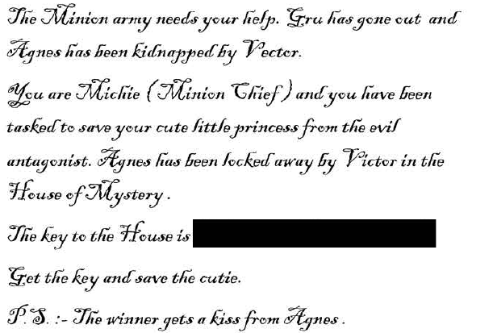

_[<<< Return to BitsCTF 2017 tasks and writeups](/bitsctf-2017)_
# Banana Princess (Crypto, 20 points)

>The princess has been kidnapped! It is up to you to rescue her now, with the help of the minions. [They have provided you with a letter](MinionQuest.pdf) (which may or may not have touched the kidnappers hands on its way to you).

We are given a link to a file which is supposed to be a PDF file and which is named "MinionQuest.pdf".

If it is really a PDF file, it really seems corrupted because it can't be loaded into a viewer or a browser.

```console
root@blinils:~/bitsctf-2017# file MinionQuest.pdf
MinionQuest.pdf: data

root@blinils:~/bitsctf-2017# strings MinionQuest.pdf | head -n4
%CQS-1.5
4 0 bow
<</Yvarnevmrq 1/Y 430190/B 6/R 404343/A 1/G 429991/U [ 576 155]>>
raqbow
```

We read %CQS-1.5 instead of %PDF-1.5, it looks like the whole file has been ciphered with ROT13, which replaces each letter by its partner 13 characters further along the alphabet. Let's check this assumption!

```python
>>> "%CQS-1.5 / raqbow / Yvarnevmrq".encode("rot13")
'%PDF-1.5 / endobj / Linearized'
```

OK, now we have to do the same, but this time [on the whole file!](rot13Minion.pdf)

```console
root@blinils:~/bitsctf-2017# cat MinionQuest.pdf | tr 'A-Za-z' 'N-ZA-Mn-za-m' > rot13Minion.pdf
root@blinils:~/bitsctf-2017# file rot13Minion.pdf
rot13Minion.pdf: PDF document, version 1.5
root@blinils:~/bitsctf-2017# xpdf rot13Minion.pdf
```



Dammit! The flag is covered by a black rectangle.

After a few tries, I copied the original picture in Paint, and then I was able to read the flag.


